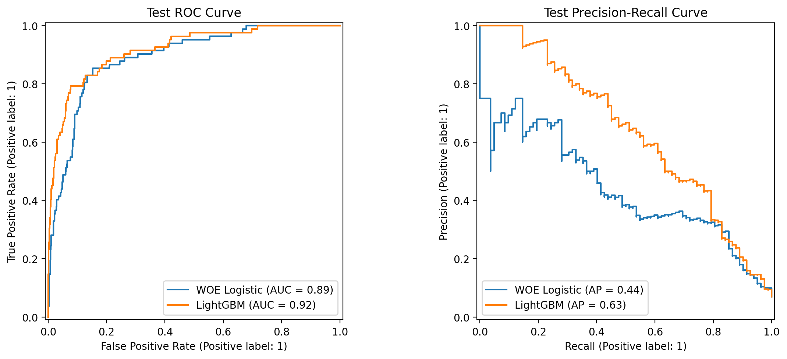
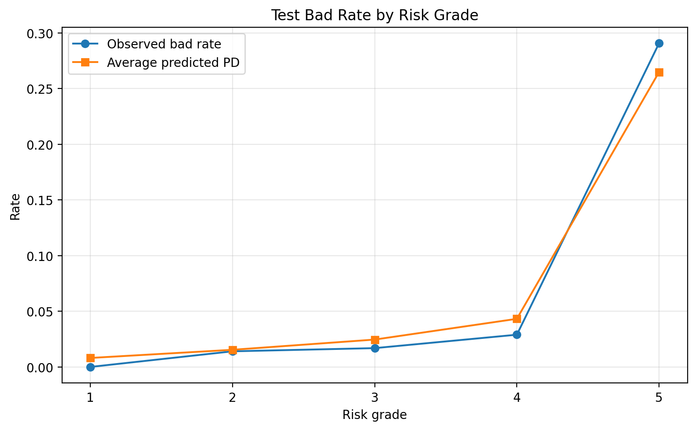
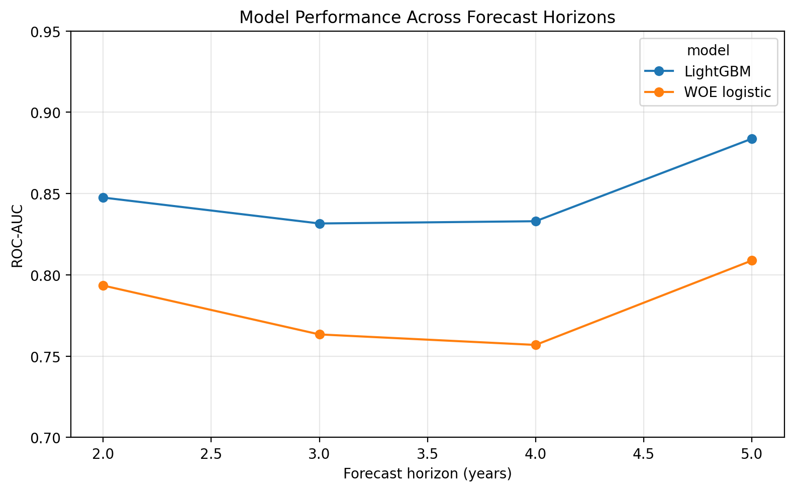

# Polish Company Bankruptcy Scorecard

UCI의 **Polish Companies Bankruptcy** 공개 데이터를 이용해 기업 부도 예측 과정을 구현한 개인 학습 프로젝트입니다. 재무비율을 WOE(Weight of Evidence)로 변환한 로지스틱 회귀 스코어카드를 구축하고, 같은 최종 변수로 학습한 LightGBM과 성능 및 해석 결과를 비교했습니다.

이 프로젝트는 기업여신 평가모형의 기본 흐름을 이해하기 위한 실습이며, 실제 금융기관의 운영모형이나 공식 검증 결과가 아닙니다.

## 1. 분석 목표

- 재무비율을 이용해 기업의 부도 여부를 구분합니다.
- 구간화, WOE, IV를 이용해 설명 가능한 로지스틱 스코어카드를 만듭니다.
- 예측확률을 신용점수와 위험등급으로 변환합니다.
- 같은 최종 변수로 LightGBM을 학습해 전통적인 스코어카드와 비교합니다.
- 다른 예측기간 자료에 모델을 적용해 성능과 점수분포 변화를 확인합니다.

## 2. 데이터

- 출처: [UCI Machine Learning Repository — Polish Companies Bankruptcy](https://doi.org/10.24432/C5F600)
- 전체 관측치: 43,405건
- 입력변수: 재무비율 64개(`A1`~`A64`)
- 타깃: `class` (`0`: 정상, `1`: 부도)
- `year`: 달력 연도가 아니라 재무제표 관측 후 부도까지의 예측기간 구분

모델 개발에는 `year=5` 자료를 사용했습니다. 이 자료는 재무제표 관측 후 **1년 이내 부도 여부**를 예측하는 표본입니다.

| 표본 | 관측치 | 부도기업 | 부도율 |
|---|---:|---:|---:|
| 훈련 | 3,546 | 246 | 6.94% |
| 검증 | 1,182 | 82 | 6.94% |
| 테스트 | 1,182 | 82 | 6.94% |

계층화 무작위 분할을 사용해 훈련·검증·테스트 표본의 부도율을 동일하게 유지했습니다.

## 3. 분석 과정

```text
데이터 확인 및 표본 정의
        ↓
훈련·검증·테스트 분할
        ↓
훈련 표본 기준 결측 변수 제외
        ↓
Optimal Binning과 WOE·IV 계산
        ↓
검증 단변량 AUC와 관계 방향 확인
        ↓
WOE 상관관계와 해석 가능성 검토
        ↓
7변수 로지스틱 스코어카드 구축
        ↓
위험등급·점수표 생성
        ↓
LightGBM·SHAP 비교
        ↓
다른 예측기간 적용 및 PSI 확인
```

### 후보 변수 처리

- 결측률 30% 이상 변수는 훈련 표본을 기준으로 제외했습니다.
- Optimal Binning의 최대 일반 구간 수는 6, 최소 구간 크기는 5%로 설정했습니다.
- 결측값과 특수값을 실제 WOE 변환에서는 0으로 처리했습니다.
- 다음 기준을 모두 만족하는 변수를 1차 후보로 삼았습니다.
  - IV ≥ 0.10
  - 검증 단변량 AUC ≥ 0.65
  - 훈련·검증 AUC 차이의 절댓값 ≤ 0.05
  - 훈련과 검증에서 관계 방향 일치
- 후보 WOE 변수 사이의 절대 상관계수가 0.70 이상이면 검증 AUC가 높은 변수를 우선 유지했습니다.

위 기준은 이 프로젝트에서 탐색적으로 사용한 기준이며 보편적인 산업 기준으로 주장하지 않습니다.

### A21 제외

`A21`의 훈련 IV는 높았지만 결측 59건 중 57건이 부도였고, 결측 구간이 전체 IV의 약 60%를 차지했습니다. 수집 과정이 알려지지 않은 결측 패턴에 모델이 과도하게 의존할 가능성을 고려해 최종 후보에서 제외했습니다.

## 4. 최종 로지스틱 변수

| 변수 | 재무비율 의미 |
|---|---|
| A27 | 영업이익 / 금융비용 |
| A39 | 매출이익 / 매출액 |
| A46 | (유동자산 − 재고자산) / 단기부채 |
| A25 | (자기자본 − 자본금) / 총자산 |
| A24 | 최근 3년 총이익 / 총자산 |
| A55 | 운전자본 |
| A38 | 고정자본 / 총자산 |

9변수 모델과 7변수 모델의 검증 AUC는 각각 0.8948과 0.8946으로 차이가 작았습니다. 검증 성능과 설명의 간결성을 함께 고려해 7변수 모델을 최종 로지스틱 모델로 선택했습니다. 이 차이에 대한 통계적 우월성을 검정한 것은 아닙니다.

## 5. 모델 성능

### 테스트 표본

| 모델 | ROC-AUC | AP | KS | Brier score | Log loss |
|---|---:|---:|---:|---:|---:|
| WOE 로지스틱 | 0.8925 | 0.4408 | 0.7009 | 0.0492 | 0.1727 |
| LightGBM | 0.9185 | 0.6344 | 0.7154 | 0.0393 | 0.1439 |

LightGBM의 테스트 성능이 더 높았지만, 두 모델은 입력 표현과 결측 처리 방식이 다릅니다. 로지스틱은 WOE 변환값을 사용하고 LightGBM은 원래 재무비율을 사용하므로 결과를 알고리즘만의 순수한 비교로 해석하지 않았습니다.



## 6. 점수와 위험등급

로지스틱 회귀의 예측확률을 다음 설정으로 점수화했습니다.

- 기준점수: 600점
- 기준오즈: 정상 대 부도 50:1
- PDO(Points to Double the Odds): 20점

확률이 (p)일 때 점수는 다음과 같이 계산합니다.

> **Score(p) = Offset + Factor × ln((1 − p) / p)**  
> **Factor = 20 / ln(2)**

훈련 표본의 예측확률 분위수로 5개 위험등급 경계를 정하고, 같은 경계를 검증·테스트 표본에 적용했습니다. 1등급은 상대적으로 안전한 집단, 5등급은 상대적으로 위험한 집단입니다.

### 테스트 표본의 등급별 결과

| 위험등급 | 관측치 | 부도기업 | 실제 부도율 | 평균 예측 PD | 평균 점수 |
|---:|---:|---:|---:|---:|---:|
| 1 | 255 | 0 | 0.00% | 0.81% | 627.14 |
| 2 | 214 | 3 | 1.40% | 1.54% | 607.48 |
| 3 | 237 | 4 | 1.69% | 2.46% | 593.60 |
| 4 | 242 | 7 | 2.89% | 4.32% | 577.20 |
| 5 | 234 | 68 | 29.06% | 26.48% | 522.54 |

등급이 높아질수록 테스트 표본의 실제 부도율이 증가했습니다. 다만 한 번의 분할 결과이므로 등급 체계의 일반적 안정성을 입증한 것으로 해석하지 않습니다.



## 7. LightGBM과 SHAP

LightGBM은 로지스틱 모델과 같은 7개 재무변수를 사용했습니다. 검증 표본의 SHAP 값을 이용해 변수별 기여 크기와 방향을 확인했습니다.

- 평균 절대 SHAP 기준으로 `A27`의 기여가 가장 컸습니다.
- `A25`, `A38`, `A39`, `A46`의 변수값과 SHAP 값 사이에는 음의 순위상관이 관측됐습니다.
- SHAP 값은 로그 오즈 공간에서의 모델 기여이며 인과효과나 확률의 퍼센트포인트가 아닙니다.

## 8. 다른 예측기간 적용

`year=5` 훈련 표본에서 결정한 구간, WOE, 로지스틱 계수와 LightGBM 모델을 `year=1`~`4` 자료에 그대로 적용했습니다.

| 재무제표 관측 후 예측기간 | WOE 로지스틱 AUC | LightGBM AUC | 점수 PSI |
|---:|---:|---:|---:|
| 2년 | 0.7934 | 0.8475 | 0.0316 |
| 3년 | 0.7634 | 0.8316 | 0.0348 |
| 4년 | 0.7569 | 0.8330 | 0.0362 |
| 5년 | 0.8088 | 0.8837 | 0.0379 |

점수 PSI는 모두 낮았지만 AUC는 1년 예측용 테스트 결과보다 하락했습니다. 이는 **점수의 주변분포가 비슷한 것**과 **타깃에 대한 순위 구분력이 유지되는 것**이 서로 다른 문제임을 보여줍니다.



## 9. 프로젝트 구조

```text
polish-company-bankruptcy-scorecard/
├── README.md
├── requirements.txt
├── .gitignore
├── notebooks/
│   └── polish_company_bankruptcy_modeling.ipynb
└── results/
    ├── split_summary.csv
    ├── final_variables.csv
    ├── logistic_coefficients.csv
    ├── model_comparison.csv
    ├── test_grade_summary.csv
    ├── scorecard_points.csv
    ├── shap_interpretation.csv
    ├── cross_horizon_performance.csv
    ├── cross_horizon_psi.csv
    ├── model_manifest.json
    ├── test_roc_pr_curves.png
    ├── test_grade_bad_rate.png
    ├── cross_horizon_auc.png
    └── cross_horizon_psi.png
```

노트북이 생성하는 중간 결과 CSV도 재현 확인을 위해 `results/`에 함께 둘 수 있습니다.

## 10. 실행 방법

1. 새 Python 환경 또는 Google Colab 런타임을 준비합니다.
2. 저장소 루트에서 필요한 패키지를 설치합니다.

```bash
pip install -r requirements.txt
```

3. 다음 노트북을 위에서 아래로 실행합니다.

```text
notebooks/polish_company_bankruptcy_modeling.ipynb
```

데이터는 `ucimlrepo`를 통해 실행 중 내려받으므로 원본 데이터 파일을 저장소에 포함하지 않습니다. 인터넷 연결이 필요합니다.

## 11. 한계

- 공개 해외 데이터를 이용한 개인 학습 프로젝트입니다.
- 기업 ID가 없어 서로 다른 예측기간 자료에 동일 기업이 포함됐는지 확인할 수 없습니다.
- 단일 무작위 분할이며, 검증 표본을 변수 선택과 LightGBM 조기 종료에 반복 사용했습니다.
- 초기 분석에서 분할 전 전체 자료의 타깃 관계를 탐색했기 때문에 테스트 표본이 분석자의 탐색에서 완전히 차단된 신규 검증은 아닙니다.
- `year=1`~`4`는 달력상 미래 시점의 자료가 아니므로 시간 외 검증 또는 독립적인 외부검증으로 부르지 않습니다.
- LightGBM과 로지스틱은 입력 표현과 결측 처리 방식이 달라 알고리즘만의 순수 비교가 아닙니다.
- 점수와 위험등급은 학습 목적의 예시이며 실제 여신 심사 기준으로 사용할 수 없습니다.
- 성능 수치는 한 번의 분할 결과이므로 반복 교차검증이나 독립 데이터 검증이 추가로 필요합니다.

## 12. 사용 도구

- Python
- pandas, NumPy, SciPy
- scikit-learn
- OptBinning
- LightGBM
- SHAP
- Matplotlib
- ucimlrepo

## 13. 참고자료

- UCI Machine Learning Repository, [Polish Companies Bankruptcy](https://doi.org/10.24432/C5F600)
- OptBinning, [Binary Optimal Binning](https://gnpalencia.org/optbinning/binning_binary.html)

